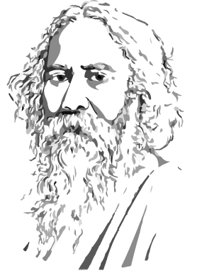
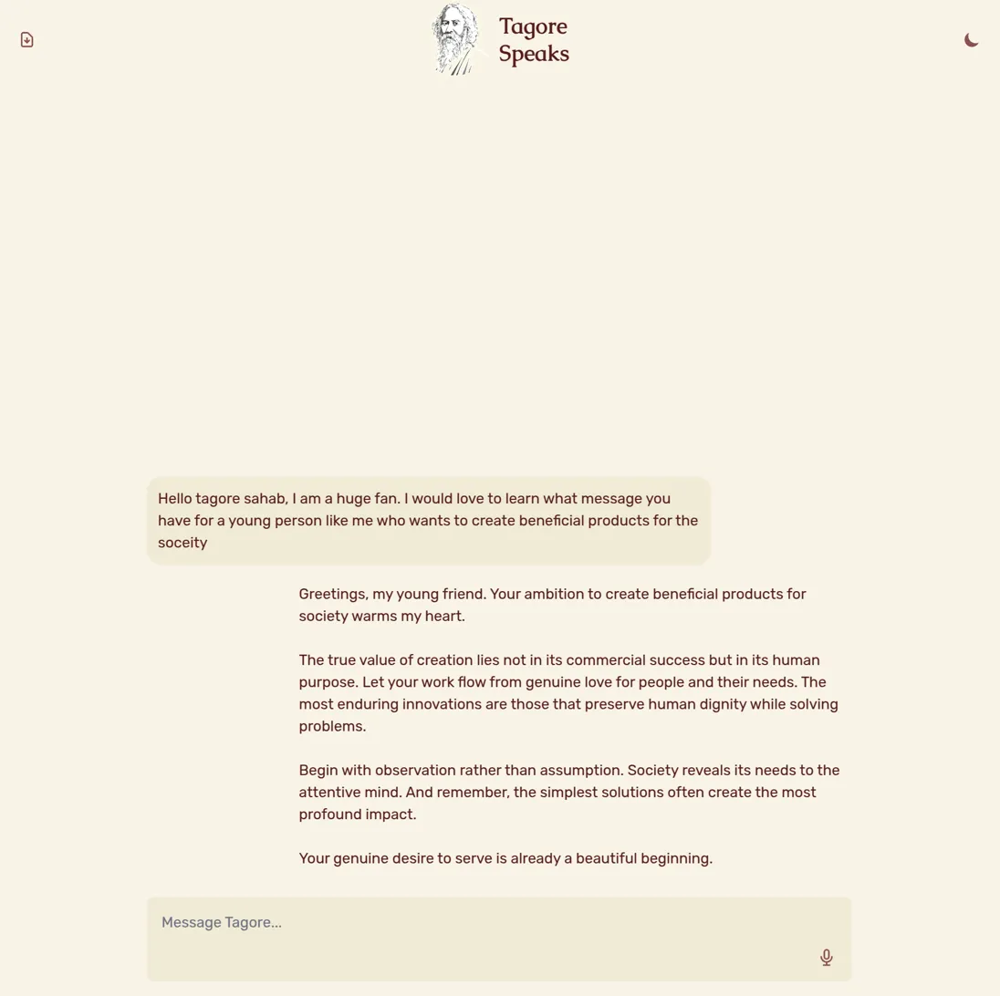

# Tagore Speaks

<div align="center">
  
  <h3>Have a conversation with Rabindranath Tagore</h3>
</div>

## 📑 Table of Contents

-   [Overview](#-overview)
-   [Features](#-features)
-   [Technology Stack](#️-technology-stack)
    -   [Frontend](#frontend)
    -   [Backend](#backend)
    -   [Database](#database)
-   [Getting Started](#-getting-started)
    -   [Prerequisites](#prerequisites)
    -   [Installation](#installation)
-   [How It Works](#-how-it-works)
-   [Project Structure](#-project-structure)
-   [Contributing](#-contributing)
-   [License](#-license)
-   [Acknowledgements](#-acknowledgements)

## 🌟 Overview

"Tagore Speaks" is an interactive AI application that lets you engage in meaningful conversations with Rabindranath Tagore, one of history's most profound thinkers and poets. Ask questions, seek wisdom, or explore his vast literary works - all through a natural conversational interface.



## ✨ Features

-   **Interactive AI Chat**: Engage with a virtual Tagore persona that responds with the wisdom, tone, and perspective of the real Tagore
-   **Voice Interaction**: Speak directly to Tagore and hear his responses in a voice modeled after historical recordings
-   **Literary Repository**: Access and explore Tagore's extensive works including poems, essays, short stories, and non-fiction
-   **Dual Interaction Modes**: Choose between text or voice-based conversations
-   **Dark/Light Mode**: Comfortable viewing experience in any lighting environment
-   **Export Conversations**: Save your meaningful exchanges as PDF documents
-   **Conversation Memory**: Continue previous conversations where you left off

## 🛠️ Technology Stack

### Frontend

-   React.js with TypeScript
-   Tailwind CSS for styling
-   Web Speech API for speech recognition
-   Cartesia API for text-to-speech generation

### Backend

-   Python Flask server
-   Anthropic Claude AI models for conversation
-   Custom tools for retrieving content from Tagore's works
-   RESTful API architecture

### Database

-   SQLite3 for storing Tagore's literary works
-   Categorized repository (poems, essays, short stories, non-fiction)
-   Conversation storage system

## 🚀 Getting Started

### Prerequisites

-   Node.js (v20+)
-   Python (v3.10+)
-   Conda package manager
-   API keys for Anthropic and Cartesia (for voice generation)

### Installation

1. **Clone the repository**

    ```bash
    git clone https://github.com/yourusername/tagore-speaks.git
    cd tagore-speaks
    ```

2. **Set up the backend with Conda**

    ```bash
    cd tagore-backend

    # Create and activate Conda environment
    conda env create -f environment.yml
    conda activate tagore

    # Create a .env file with your API keys
    echo "ANTHROPIC_API_KEY=your_anthropic_key" > .env
    echo "CARTESIA_API_KEY=your_cartesia_key" > .env
    ```

    > 📝 Note: If `environment.yml` is not available in the repository, you'll need to create it first using:
    >
    > ```bash
    > conda env export > environment.yml
    > ```

3. **Set up the frontend**

    ```bash
    cd ../tagore-frontend
    npm install

    # [Optional] Create a .env file for frontend configuration
    echo "VITE_API_URL=http://localhost:5000" > .env # Optional
    ```

4. **Run the application**

    In the first terminal (frontend):

    ```bash
    cd tagore-frontend
    npm run dev
    ```

    In another terminal (backend):

    ```bash
    cd tagore-backend
    conda activate tagore
    python app.py
    ```

5. **Access the application**

    Open your browser and navigate to `http://localhost:5173`

## 📖 How It Works

1. **Conversation Flow**: User queries are processed by the Anthropic Claude model, personalized with a carefully crafted system prompt that embodies Tagore's personality and wisdom.

2. **Literary Database**: Tagore's works are categorized and stored in a SQLite database, which the AI can reference using custom-built tools.

3. **Voice Interaction**:

    - Speech recognition captures user's spoken queries
    - Tagore's responses are generated as text by the AI
    - Cartesia's text-to-speech API converts responses to speech using a voice model trained on Tagore's actual recordings

4. **Persistent Memory**: Conversations are stored with unique IDs, allowing users to continue previous discussions.

## 🧩 Project Structure

```
tagore-speaks/
├── tagore-frontend/                    # React.js frontend application
│   ├── src/
│   │   ├── components/                 # UI components
│   │   ├── services/                   # API and service integrations
│   │   └── theme/                      # Theming and styling
│   └── ...
├── tagore-backend/                     # Python Flask backend
│   ├── routes/                         # API endpoints
│   ├── services/                       # Business logic
│   ├── tools/                          # Custom LLM tools
│   └── ...
└── tagore-data/                        # Data management
    ├── tagore-data/                    # SQLite Tagore Creations database
    ├── tagore_speaks_conversations.db  # SQLite chat database
    └── ...
```

## 🤝 Contributing

We welcome contributions to this project! Please see our [CONTRIBUTING.md](CONTRIBUTING.md) for guidelines on how to contribute.

## 📜 License

This project is licensed under the MIT License - see the [LICENSE](LICENSE) file for details.

## 🙏 Acknowledgements

-   Rabindranath Tagore, for his timeless wisdom and prolific works
-   Anthropic, for their Claude AI models
-   Cartesia, for their text-to-speech technology
-   All translators and publishers who have made Tagore's works accessible in English

---

<div align="center">
  <p>Created with 💖 for lovers of literature, philosophy, and meaningful conversation by <a href="https://abhiagni.com" target="_blank">
                        abhiagni.com</a></p>
</div>
